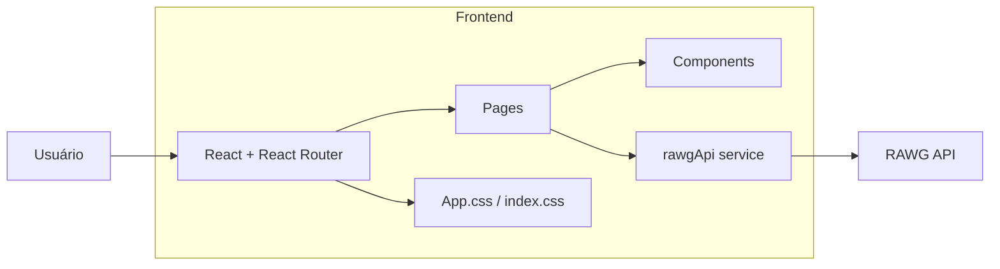

# 🎮 GameDex Web

Aplicação web para descobrir jogos usando a **RAWG API**, com foco em experiência moderna, animações suaves e visual premium.

---

## ✨ Destaques

- Home com seções de jogos em alta.
- Busca com filtros (gênero, plataforma e ordenação).
- Página completa de detalhes com estatísticas e screenshots.
- Layout responsivo com sidebar, header e footer refinados.
- Skeleton loading para carregamento visualmente agradável.

---

## 🚀 Funcionalidades

### Home (`/`)
- Seções: **Trending Games**, **Top Rated** e **Lançamentos**.
- Cards com animações e microinterações.

### Busca (`/search`)
- Pesquisa por nome.
- Filtro por gênero.
- Filtro por plataforma.
- Ordenação por relevância, nota, data e popularidade.

### Detalhes (`/game/:id`)
- Banner/capa do jogo.
- Nota, Metacritic, tempo médio e avaliações.
- Bloco de descrição.
- Informações organizadas (dev, publicadora, classificação etc.).
- Grid de screenshots.

### Outras páginas
- **Sobre** (`/about`) com visão do projeto e stack.
- **App** (`/download`) com download de APK e link do repositório.

---

## 🧱 Stack Técnica

| Camada | Tecnologias |
|---|---|
| Front-end | React 19, React Router DOM |
| Build | Vite 7 |
| Estilo/UI | CSS custom + Tailwind CSS (plugin Vite) |
| Animações | Framer Motion |
| Requisições | Axios |
| Ícones | React Icons |

---

## 🔌 API

- API: **RAWG Video Games Database**
- Docs: https://rawg.io/apidocs

### Endpoints usados

- `GET /games`
- `GET /games?search=...`
- `GET /games/{id}`
- `GET /games/{id}/screenshots`
- `GET /genres`
- `GET /platforms/lists/parents`

---

## ⚙️ Como rodar localmente

### 1) Instalar dependências

```bash
npm install
```

### 2) Configurar variável de ambiente

Crie um arquivo `.env` na raiz:

```env
VITE_RAWG_API_KEY=sua_chave_rawg
```

### 3) Rodar em desenvolvimento

```bash
npm run dev
```

### 4) Build de produção

```bash
npm run build
```

### 5) Pré-visualizar build

```bash
npm run preview
```

---

## 📜 Scripts

- `npm run dev` → inicia ambiente de desenvolvimento.
- `npm run build` → gera versão de produção.
- `npm run preview` → visualiza build local.
- `npm run lint` → executa lint do projeto.

---

## 📁 Estrutura do Projeto

```text
src/
  assets/
  components/
  pages/
  services/
  App.jsx
  App.css
  index.css
```

---

## 🏗️ Arquitetura da Aplicação



---

## 🖼️ Prints da Aplicação

> Dica: salve as imagens em `docs/screenshots/` e atualize os caminhos abaixo.

### Home


### Busca


### Detalhes do jogo


### Sobre


### App


---

## 🔗 Acesso Online

- URL da aplicação: **https://SEU-LINK-DE-DEPLOY-AQUI**

---

## 📝 Observações

- O projeto depende da variável `VITE_RAWG_API_KEY`.
- Sem chave válida, os dados da API não serão carregados.

---

## 🌐 Deploy

Plataformas recomendadas:

- Vercel
- Netlify

